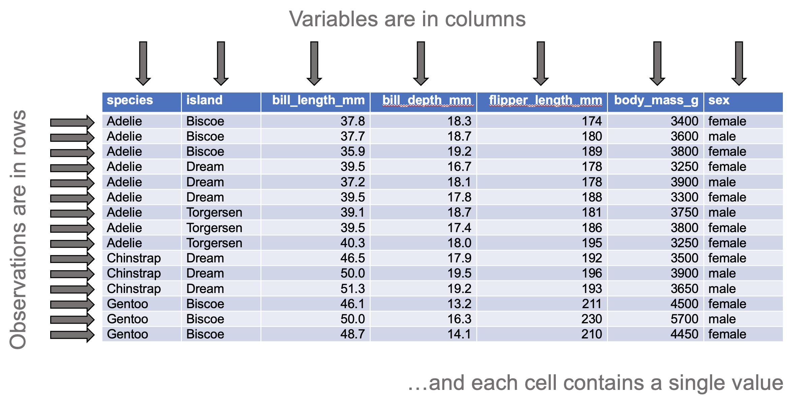

```{r setup, include = FALSE}
library(flexdashboard)
library(shiny)
library(readr)
library(dplyr)
library(tidyr)
library(ggplot2)
library(ggthemes)
```

```{r eval = FALSE}
# Packages
library(stringr)
library(palmerpenguins)

# Datasets
## Long format
### Iris
iris %>% 
    write_csv(file = 'data/iris_original.csv')

iris %>% 
    group_by(Species) %>% 
    slice_head(n = 5) %>% 
    ungroup() %>% 
    select(Species, everything()) %>% 
    write_csv(file = 'data/iris_reduced.csv')

### Penguins
penguins %>% 
    write_csv(file = 'data/penguins_orginal.csv')

penguins %>% 
    filter(complete.cases(.)) %>% 
    group_by(species, island) %>% 
    slice_head(n = 3) %>% 
    ungroup() %>% 
    select(-year) %>% 
    select(species, everything()) %>% 
    write_csv(file = 'data/penguins_sample.csv')
```

Welcome {data-navmenu='Select a plot type'}
===================================== 

<a href='https://www.wits.ac.za' target='_blank'>

</a>

**Welcome**  

The app provides basic plot options, such as box-and-whisker plots, scatter plots, bar charts, and histograms. 

To analyse your data, please use the companion app, [`statr`](https://kamermanpr.shinyapps.io/painblogr-statr/){ target='_blank' }

**Steps to plotting your data**  

- Choose the type of plot you want from the drop-down menu labelled _“Select a plot type”_.

- Upload your data (see below for format instructions).

- Select the variables to plot (the plot will be auto-generated).

- Play with the settings to fine-tune the appearance of the plot.

- Download the plot.

**Data format**  

Only CSV files can be uploaded, and the data must be **"tidy"**. By "tidy", we mean that the  data must be arranged in "long" format such that:

- Each row contains data from an observation.

- Each column contains only one variable.

- Each value must have its own cell

<div>

</div>

For a full description of tidy data, please use the following [link](https://www.jstatsoft.org/article/view/v059i10){ target='_blank' }.

To download a dataset to play around with on the app, we recommend [Allison Horst's](https://allisonhorst.github.io/palmerpenguins/index.html){ target='_blank' } "Palmer Penguins" dataset ([link to data](https://drive.google.com/open?id=1-8H1Mz2_oEMu3zlVsatraFruJQlCFqZ9&authuser=peter.kamerman%40gmail.com&usp=drive_fs){ target='_blank' })

**Developers**  

The app was developed by Peter Kamerman (WWW: [painblogr.org](https://www.painblogr.org){ target='_blank'}, GitHub: [kamermanpr](https://github.com/kamermanpr.git){ target='_blank' }) and Kavalin Nair (GitHub: [TripleBlackCat](https://github.com/TripleBlackCat.git){ target='_blank' }).

**License**  

The software is released under an [MIT license](https://github.com/kamermanpr/painblogr-plotr/blob/main/LICENSE){ target='_blank' }.

Boxplot {data-navmenu='Select a plot type'}
=====================================  

Column {.sidebar data-width=350}
-------------------------------------

```{r boxplot_1}
h1('Boxplot')

p('For plot download options, scroll to the bottom of this sidebar.')

p('The plot window will indicate an error if a discrete (categorical) variable is chosen as the response variable.')

p('Beeswarm points are "jittered" horizontally only. That is, the value of each point, as measured on the y-axis, remains unchanged.')

hr()

# Upload file
fileInput(inputId = 'box_file0', 
          label = 'Import data (csv format)',
          multiple = FALSE,
          accept = c('.csv'))

# Make reactive data
box_df <- reactive({
    req(input$box_file0)
    read_csv(input$box_file0$datapath, 
             show_col_types = FALSE)
})

# Select variables
## Response variable
output$box_yvar <- renderUI({
    varSelectInput(inputId = 'box_y_var',
                   label = 'Choose response variable',
                   selected = NULL,
                   data = box_df())
    })

uiOutput('box_yvar')

## Grouping variable
output$box_groupvar <- renderUI({
    varSelectInput(inputId = 'box_group_var',
                   label = 'Choose grouping variable',
                   selected = NULL,
                   data = box_df())
    })

uiOutput('box_groupvar')

## Second grouping variable
output$box_groupvar2 <- renderUI({
    selectInput(inputId = 'box_group2_var',
                label = 'Choose second grouping variable (optional)',
                selected = 'None',
                choices = c('None', names(box_df())))
    })

uiOutput('box_groupvar2')

## Choose plot type
radioButtons(inputId = 'box_plot_type',
             label = 'Plot type',
             choices = c('Simple boxplot (default)' = 'box',
                         'Add beeswarm' = 'box_points'),
             selected = 'box')

## Add labels
textInput(inputId = 'box_title', 
          label = 'Plot title',
          value = NULL)

textInput(inputId = 'box_y_label', 
          label = 'Y-axis label',
          value = NULL)

textInput(inputId = 'box_x_label', 
          label = 'X-axis label',
          value = NULL)

## Base font size
sliderInput(inputId = 'box_base_size',
            label = 'Font size',
            value = 18,
            min = 8,
            max = 28)

## Y-axis limits
numericInput(inputId = 'box_min_y',
             label = 'Minimum y-axis value',
             value = NULL)

numericInput(inputId = 'box_max_y',
             label = 'Maximum y-axis value',
             value = NULL)

## Point size size
sliderInput(inputId = 'box_size',
            label = 'Point size (beeswarm points)',
            value = 3,
            min = 0,
            max = 10)

## Point transparency size
sliderInput(inputId = 'box_alpha',
            label = 'Point transparency (beeswarm points)',
            value = 1,
            min = 0,
            max = 1)

## Point scatter width
sliderInput(inputId = 'box_scatter_width',
            label = 'Scatter width (beeswarm points)',
            value = 0.3,
            min = 0,
            max = 1)

hr()

strong('Options for the second grouping variable')

## Colour scheme
selectInput(inputId = 'box_colours',
            label = 'Colour scheme',
            selected = NULL,
            choices = c('Default (20 colours)' = 'Tableau 20',
                        'Tableau (10 colours)' = 'Tableau 10',
                        'Colour blind (10 colours)' = 'Color Blind',
                        'Grey (5 colours)' = 'Classic Gray 5'))

## Legend position
radioButtons(inputId = 'box_legend_position',
             label = 'Legend position',
             choices = c('None' = 'none',
                         'Right side of plot' = 'right',
                         'Above the plot' = 'top',
                         'User-defined' = 'legend_user'),
             selected = 'none')

### x value
sliderInput(inputId = 'box_x_legend',
            label = 'User-defined legend position (x coordinate)',
            value = 0.85,
            min = 0,
            max = 1)

### y-value
sliderInput(inputId = 'box_y_legend',
            label = 'User-defined legend position (y coordinate)',
            value = 0.85,
            min = 0,
            max = 1)

hr()

h1('Download plot')

# Format
selectInput(inputId = 'box_format',
            label = 'Choose file format',
            selected = 'png',
            choices = c('bmp', 'jpg', 'pdf', 'png'))

# Plot width
numericInput(inputId = 'box_width',
             label = 'Figure width (cm)',
             value = 17)

## Plot height
numericInput(inputId = 'box_height',
             label = 'Figure height (cm)',
             value = 14)

# Add download button
output$box_download_button <- renderUI({
    downloadButton(outputId = 'boxplot_download_button',
                   label = "'Click' to download image")
    })

uiOutput('box_download_button')
```

Column
-------------------------------------

### Plot

```{r boxplot_2}
# Plot graph
output$box_plot <- renderPlot(
    if(req(input$box_plot_type) == 'box'){
        
        if(req(input$box_group2_var) == 'None'){
            
            box_df() %>%
                drop_na(input$box_group_var) %>% 
                ggplot(data = .) +
                aes(x = !!input$box_group_var,
                    y = !!input$box_y_var) +
                geom_boxplot() +
                labs(title = input$box_title,
                     y = input$box_y_label,
                     x = input$box_x_label) +
                scale_y_continuous(limits = c(input$box_min_y, input$box_max_y)) +
                scale_x_discrete(na.translate = FALSE) +
                theme_minimal(base_size = input$box_base_size) +
                theme(legend.position = 'none',
                          plot.background = element_rect(colour = '#FFFFFF',
                                                         fill = '#FFFFFF'),
                          plot.title = element_text(size = input$box_base_size),
                          axis.text = element_text(colour = '#000000'),
                          axis.line = element_line(colour = '#000000',
                                                   size = 0.5),
                          axis.ticks = element_line(colour = '#000000',
                                                    size = 0.5),
                          panel.grid = element_blank()) 
            
        } else {
            
            if(input$box_legend_position != 'legend_user'){
                
                box_df() %>% 
                        ggplot(data = .) +
                        aes(x = !!input$box_group_var,
                            y = !!input$box_y_var,
                            fill = box_df()[[input$box_group2_var]],
                            colour = box_df()[[input$box_group2_var]]) +
                    geom_boxplot(alpha = 0.6) +
                    labs(title = input$box_title,
                         y = input$box_y_label,
                         x = input$box_x_label) +
                    scale_y_continuous(limits = c(input$box_min_y, input$box_max_y)) +
                    scale_x_discrete(na.translate = FALSE) +
                    scale_fill_tableau(palette = input$box_colours,
                                       na.translate = FALSE) +
                    scale_colour_tableau(palette = input$box_colours,
                                         na.translate = FALSE) +
                    theme_minimal(base_size = input$box_base_size) +
                    theme(legend.position = input$box_legend_position,
                          legend.title = element_blank(),
                          plot.background = element_rect(colour = '#FFFFFF',
                                                         fill = '#FFFFFF'),
                          plot.title = element_text(size = input$box_base_size),
                          axis.text = element_text(colour = '#000000'),
                          axis.line = element_line(colour = '#000000',
                                                   size = 0.5),
                          axis.ticks = element_line(colour = '#000000',
                                                    size = 0.5),
                          panel.grid = element_blank()) 
                
                } else if(input$box_legend_position == 'legend_user'){
                    
                    box_df() %>% 
                        ggplot(data = .) +
                        aes(x = !!input$box_group_var,
                            y = !!input$box_y_var,
                            fill = box_df()[[input$box_group2_var]],
                            colour = box_df()[[input$box_group2_var]]) +
                        geom_boxplot(alpha = 0.6) +
                        labs(title = input$box_title,
                             y = input$box_y_label,
                             x = input$box_x_label) +
                        scale_y_continuous(limits = c(input$box_min_y, input$box_max_y)) +
                        scale_x_discrete(na.translate = FALSE) +
                        scale_fill_tableau(palette = input$box_colours,
                                           na.translate = FALSE) +
                        scale_colour_tableau(palette = input$box_colours,
                                             na.translate = FALSE) +
                        theme_minimal(base_size = input$box_base_size) +
                        theme(legend.position = c(input$box_x_legend, input$box_y_legend),
                              legend.title = element_blank(),
                              plot.background = element_rect(colour = '#FFFFFF',
                                                             fill = '#FFFFFF'),
                              plot.title = element_text(size = input$box_base_size),
                              axis.text = element_text(colour = '#000000'),
                              axis.line = element_line(colour = '#000000',
                                                       size = 0.5),
                              axis.ticks = element_line(colour = '#000000',
                                                        size = 0.5),
                              panel.grid = element_blank()) 
                    
                }
            }
        
        } else if(input$box_plot_type == 'box_points'){
            
            if(req(input$box_group2_var) == 'None'){
            
            box_df() %>%
                drop_na(input$box_group_var) %>% 
                ggplot(data = .) +
                aes(x = !!input$box_group_var,
                    y = !!input$box_y_var) +
                geom_boxplot(outlier.shape = NA) +
                geom_point(position = position_jitter(seed = 1234,
                                                      width = input$box_scatter_width,
                                                      height = 0),
                           fill = '#000000',
                           alpha = input$box_alpha,
                           shape = 21,
                           size = input$box_size) +
                geom_point(position = position_jitter(seed = 1234,
                                                      width = input$box_scatter_width,
                                                      height = 0),
                           shape = 21,
                           size = input$box_size) +
                labs(title = input$box_title,
                     y = input$box_y_label,
                     x = input$box_x_label) +
                scale_y_continuous(limits = c(input$box_min_y, input$box_max_y)) +
                scale_x_discrete(na.translate = FALSE) +
                theme_minimal(base_size = input$box_base_size) +
                theme(legend.position = 'none',
                          plot.background = element_rect(colour = '#FFFFFF',
                                                         fill = '#FFFFFF'),
                          plot.title = element_text(size = input$box_base_size),
                          axis.text = element_text(colour = '#000000'),
                          axis.line = element_line(colour = '#000000',
                                                   size = 0.5),
                          axis.ticks = element_line(colour = '#000000',
                                                    size = 0.5),
                          panel.grid = element_blank()) 
            
        } else {
            
            if(input$box_legend_position != 'legend_user'){
                
                box_df() %>% 
                        ggplot(data = .) +
                        aes(x = !!input$box_group_var,
                            y = !!input$box_y_var,
                            fill = box_df()[[input$box_group2_var]],
                            colour = box_df()[[input$box_group2_var]]) +
                    geom_boxplot(outlier.shape = NA,
                                 alpha = 0.6) +
                    geom_point(position = position_jitterdodge(seed = 1234,
                                                          jitter.width = input$box_scatter_width,
                                                          jitter.height = 0),
                               alpha = input$box_alpha,
                               shape = 21,
                               size = input$box_size) +
                    geom_point(position = position_jitterdodge(seed = 1234,
                                                          jitter.width = input$box_scatter_width,
                                                          jitter.height = 0),
                               fill = NA,
                               shape = 21,
                               size = input$box_size) +
                    labs(title = input$box_title,
                         y = input$box_y_label,
                         x = input$box_x_label) +
                    scale_y_continuous(limits = c(input$box_min_y, input$box_max_y)) +
                    scale_x_discrete(na.translate = FALSE) +
                    scale_fill_tableau(palette = input$box_colours,
                                       na.translate = FALSE) +
                    scale_colour_tableau(palette = input$box_colours,
                                         na.translate = FALSE) +
                    theme_minimal(base_size = input$box_base_size) +
                    theme(legend.position = input$box_legend_position,
                          legend.title = element_blank(),
                          plot.background = element_rect(colour = '#FFFFFF',
                                                         fill = '#FFFFFF'),
                          plot.title = element_text(size = input$box_base_size),
                          axis.text = element_text(colour = '#000000'),
                          axis.line = element_line(colour = '#000000',
                                                   size = 0.5),
                          axis.ticks = element_line(colour = '#000000',
                                                    size = 0.5),
                          panel.grid = element_blank()) 
                
                } else if(input$box_legend_position == 'legend_user'){
                    
                    box_df() %>% 
                        ggplot(data = .) +
                        aes(x = !!input$box_group_var,
                            y = !!input$box_y_var,
                            fill = box_df()[[input$box_group2_var]],
                            colour = box_df()[[input$box_group2_var]]) +
                        geom_boxplot(outlier.shape = NA,
                                     alpha = 0.6) +
                        geom_point(position = position_jitterdodge(seed = 1234,
                                                              jitter.width = input$box_scatter_width,
                                                              jitter.height = 0),
                                   alpha = input$box_alpha,
                                   shape = 21,
                                   size = input$box_size) +
                        geom_point(position = position_jitterdodge(seed = 1234,
                                                              jitter.width = input$box_scatter_width,
                                                              jitter.height = 0),
                                   shape = 21,
                                   fill = NA,
                                   size = input$box_size) +
                        labs(title = input$box_title,
                             y = input$box_y_label,
                             x = input$box_x_label) +
                        scale_y_continuous(limits = c(input$box_min_y, input$box_max_y)) +
                        scale_x_discrete(na.translate = FALSE) +
                        scale_fill_tableau(palette = input$box_colours,
                                           na.translate = FALSE) +
                        scale_colour_tableau(palette = input$box_colours,
                                             na.translate = FALSE) +
                        theme_minimal(base_size = input$box_base_size) +
                        theme(legend.position = c(input$box_x_legend, input$box_y_legend),
                              legend.title = element_blank(),
                              plot.background = element_rect(colour = '#FFFFFF',
                                                             fill = '#FFFFFF'),
                              plot.title = element_text(size = input$box_base_size),
                              axis.text = element_text(colour = '#000000'),
                              axis.line = element_line(colour = '#000000',
                                                       size = 0.5),
                              axis.ticks = element_line(colour = '#000000',
                                                        size = 0.5),
                              panel.grid = element_blank()) 
                    
                }
            }
        }
)

plotOutput('box_plot')
```

```{r boxplot_3}
# Download plot
output$boxplot_download_button <- downloadHandler(
    filename = function() {
        paste0('boxplot_', Sys.Date(), '.', input$box_format)
    },
    content = function(file) {
        plotOutput('box_plot')
        ggsave(file, 
               width = input$box_width, 
               height = input$box_height,
               units = 'cm')
    }
  )
```

Scatter plot {data-navmenu='Select a plot type'}
=====================================  

Column {.sidebar data-width=350}
-------------------------------------

```{r scatter_1}
h1('Scatter plot')

p('The plot window will indicate an error if a discrete (categorical) variable is chosen as a response variable.')

p('For download options, scroll to the bottom of this sidebar.')

hr()

# Upload file
fileInput(inputId = 'scatter_file0', 
          label = 'Import data (csv format)',
          multiple = FALSE,
          accept = c('.csv'))

# Make reactive data
scatter_df <- reactive({
    req(input$scatter_file0)
    read_csv(input$scatter_file0$datapath, 
             show_col_types = FALSE)
})

# Select variables
## Y variable
output$scatter_yvar <- renderUI({
    varSelectInput(inputId = 'scatter_y_var',
                   label = 'Choose repsonse variable',
                   data = scatter_df())
    })

uiOutput('scatter_yvar')

## X variable
output$scatter_xvar <- renderUI({
    varSelectInput(inputId = 'scatter_x_var',
                   label = 'Choose repsonse variable',
                   data = scatter_df())
    })

uiOutput('scatter_xvar')

output$scatter_groupvar <- renderUI({
    selectInput(inputId = 'scatter_group_var',
            label = 'Choose grouping variable (optional)',
            selected = NULL,
            choices = c('None', names(scatter_df())))
})

uiOutput('scatter_groupvar')

## Add regression or loess curve
radioButtons(inputId = 'scatter_smooth',
             label = 'Add regression line',
             choices = c('None (default)' = 'none',
                         'Linear regression' = 'linear',
                         'LOESS curve' = 'loess'),
             selected = 'none')

## Add labels
textInput(inputId = 'scatter_title', 
          label = 'Plot title',
          value = '')

textInput(inputId = 'scatter_y_label', 
          label = 'Y-axis label',
          value = '')

textInput(inputId = 'scatter_x_label', 
          label = 'X-axis label',
          value = '')

## Base font size
sliderInput(inputId = 'scatter_base_size',
            label = 'Font size',
            value = 18,
            min = 8,
            max = 28)

## Point size size
sliderInput(inputId = 'scatter_size',
            label = 'Point size',
            value = 3,
            min = 0,
            max = 10)

## Point transparency size
sliderInput(inputId = 'scatter_alpha',
            label = 'Point transparency',
            value = 1,
            min = 0,
            max = 1)

## Y-axis limits
numericInput(inputId = 'scatter_min_y',
             label = 'Minimum y-axis value',
             value = NULL)

numericInput(inputId = 'scatter_max_y',
             label = 'Maximum y-axis value',
             value = NULL)

## X-axis limits
numericInput(inputId = 'scatter_min_x',
             label = 'Minimum x-axis value',
             value = NULL)

numericInput(inputId = 'scatter_max_x',
             label = 'Maximum x-axis value',
             value = NULL)

hr()

strong('Options for grouping variable')

## Colour scheme
selectInput(inputId = 'scatter_colours',
            label = 'Colour scheme',
            selected = NULL,
            choices = c('Default (20 colours)' = 'Tableau 20',
                        'Tableau (10 colours)' = 'Tableau 10',
                        'Colour blind (10 colours)' = 'Color Blind',
                        'Grey (5 colours)' = 'Classic Gray 5'))

## Legend position
radioButtons(inputId = 'scatter_legend_position',
             label = 'Legend position',
             choices = c('None' = 'none',
                         'Right side of plot' = 'right',
                         'Above the plot' = 'top',
                         'User-defined' = 'legend_user'),
             selected = 'none')

### x value
sliderInput(inputId = 'scatter_x_legend',
            label = 'User-defined legend position (x coordinate)',
            value = 0.85,
            min = 0,
            max = 1)

### y-value
sliderInput(inputId = 'scatter_y_legend',
            label = 'User-defined legend position (y coordinate)',
            value = 0.85,
            min = 0,
            max = 1)

hr()

h1('Download plot')

# Format
selectInput(inputId = 'scatter_format',
            label = 'Choose file format',
            selected = 'png',
            choices = c('bmp', 'jpg', 'pdf', 'png'))

# Plot width
numericInput(inputId = 'scatter_width',
             label = 'Figure width (cm)',
             value = 16)

## Plot height
numericInput(inputId = 'scatter_height',
             label = 'Figure height (cm)',
             value = 16)

# Add download button
output$scatter_download_button <- renderUI({
    downloadButton(outputId = 'scatterplot_download_button',
                   label = "'Click' to download image")
    })

uiOutput('scatter_download_button')
```

Column
-------------------------------------

### Plot

```{r scatter_2}
# Plot graph
output$scatter_plot <- renderPlot(
    
    if(req(input$scatter_smooth) == 'none' & req(input$scatter_group_var) == 'None'){
        
        ggplot(data = scatter_df()) +
        aes(x = !!input$scatter_x_var,
            y = !!input$scatter_y_var) +
        geom_point(shape = 21,
                   colour = '#000000',
                   fill = '#000000',
                   alpha = input$scatter_alpha,
                   size = input$scatter_size) +
        geom_point(shape = 21,
                   colour = '#000000',
                   size = input$scatter_size) +
        labs(title = input$scatter_title,
             y = input$scatter_y_label,
             x = input$scatter_x_label) +
        scale_x_continuous(limits = c(input$scatter_min_x, input$scatter_max_x)) +
        scale_y_continuous(limits = c(input$scatter_min_y, input$scatter_max_y)) +
        theme_minimal(base_size = input$scatter_base_size) +
        theme(plot.background = element_rect(colour = '#FFFFFF',
                                             fill = '#FFFFFF'),
              plot.title = element_text(size = input$scatter_base_size),
              axis.text = element_text(colour = '#000000'),
              axis.line = element_line(colour = '#000000',
                                       size = 0.5),
              axis.ticks = element_line(colour = '#000000',
                                        size = 0.5),
              panel.grid = element_blank())
        
    } else if(input$scatter_smooth == 'linear' & input$scatter_group_var == 'None'){
        
        ggplot(data = scatter_df()) +
        aes(x = !!input$scatter_x_var,
            y = !!input$scatter_y_var) +
        geom_point(shape = 21,
                   colour = '#000000',
                   fill = '#000000',
                   alpha = input$scatter_alpha,
                   size = input$scatter_size) +
        geom_point(shape = 21,
                   colour = '#000000',
                   size = input$scatter_size) +
        geom_smooth(method = 'lm',
                    colour = '#000000',
                    size = 1,
                    se = FALSE) +
        labs(title = input$scatter_title,
             y = input$scatter_y_label,
             x = input$scatter_x_label) +
        scale_x_continuous(limits = c(input$scatter_min_x, input$scatter_max_x)) +
        scale_y_continuous(limits = c(input$scatter_min_y, input$scatter_max_y)) +
        theme_minimal(base_size = input$scatter_base_size) +
        theme(plot.background = element_rect(colour = '#FFFFFF',
                                             fill = '#FFFFFF'),
              plot.title = element_text(size = input$scatter_base_size),
              axis.text = element_text(colour = '#000000'),
              axis.line = element_line(colour = '#000000',
                                       size = 0.5),
              axis.ticks = element_line(colour = '#000000',
                                        size = 0.5),
              panel.grid = element_blank())
        
    } else if(input$scatter_smooth == 'loess' & input$scatter_group_var == 'None'){
        
        ggplot(data = scatter_df()) +
        aes(x = !!input$scatter_x_var,
            y = !!input$scatter_y_var) +
        geom_point(shape = 21,
                   colour = '#000000',
                   fill = '#000000',
                   alpha = input$scatter_alpha,
                   size = input$scatter_size) +
        geom_point(shape = 21,
                   colour = '#000000',
                   size = input$scatter_size) +
        geom_smooth(method = 'loess',
                    colour = '#000000',
                    size = 1,
                    se = FALSE) +
        labs(title = input$scatter_title,
             y = input$scatter_y_label,
             x = input$scatter_x_label) +
        scale_x_continuous(limits = c(input$scatter_min_x, input$scatter_max_x)) +
        scale_y_continuous(limits = c(input$scatter_min_y, input$scatter_max_y)) +
        theme_minimal(base_size = input$scatter_base_size) +
        theme(plot.background = element_rect(colour = '#FFFFFF',
                                                 fill = '#FFFFFF'),
              plot.title = element_text(size = input$scatter_base_size),
              axis.text = element_text(colour = '#000000'),
              axis.line = element_line(colour = '#000000',
                                       size = 0.5),
              axis.ticks = element_line(colour = '#000000',
                                        size = 0.5),
              panel.grid = element_blank())
        
    } else if(input$scatter_smooth == 'linear' & input$scatter_group_var != 'None'){
        
        if(input$scatter_legend_position != 'legend_user'){
            
            ggplot(data = scatter_df()) +
                aes(x = !!input$scatter_x_var,
                    y = !!input$scatter_y_var,
                    fill = scatter_df()[[input$scatter_group_var]],
                    colour = scatter_df()[[input$scatter_group_var]]) +
                geom_point(shape = 21,
                           alpha = input$scatter_alpha,
                           size = input$scatter_size) +
                geom_point(shape = 21,
                           fill = NA,
                           size = input$scatter_size) +
                geom_smooth(method = 'lm',
                            size = 1,
                            se = FALSE) +
                labs(title = input$scatter_title,
                     y = input$scatter_y_label,
                     x = input$scatter_x_label) +
                scale_x_continuous(limits = c(input$scatter_min_x, input$scatter_max_x)) +
                scale_y_continuous(limits = c(input$scatter_min_y, input$scatter_max_y)) +
                scale_colour_tableau(palette = input$scatter_colours,
                                     na.translate = FALSE) +
                scale_fill_tableau(palette = input$scatter_colours,
                                   na.translate = FALSE) +
                theme_minimal(base_size = input$scatter_base_size) +
                theme(plot.background = element_rect(colour = '#FFFFFF',
                                                     fill = '#FFFFFF'),
                      plot.title = element_text(size = input$scatter_base_size),
                      legend.position = input$scatter_legend_position,
                      legend.title = element_blank(),
                      axis.text = element_text(colour = '#000000'),
                      axis.line = element_line(colour = '#000000',
                                               size = 0.5),
                      axis.ticks = element_line(colour = '#000000',
                                                size = 0.5),
                      panel.grid = element_blank())
            
        } else if(input$scatter_legend_position == 'legend_user'){
            
            ggplot(data = scatter_df()) +
                aes(x = !!input$scatter_x_var,
                    y = !!input$scatter_y_var,
                    fill = scatter_df()[[input$scatter_group_var]],
                    colour = scatter_df()[[input$scatter_group_var]]) +
                geom_point(shape = 21,
                           alpha = input$scatter_alpha,
                           size = input$scatter_size) +
                geom_point(shape = 21,
                           fill = NA,
                           size = input$scatter_size) +
                geom_smooth(method = 'lm',
                            size = 1,
                            se = FALSE) +
                labs(title = input$scatter_title,
                     y = input$scatter_y_label,
                     x = input$scatter_x_label) +
                scale_x_continuous(limits = c(input$scatter_min_x, input$scatter_max_x)) +
                scale_y_continuous(limits = c(input$scatter_min_y, input$scatter_max_y)) +
                scale_colour_tableau(palette = input$scatter_colours,
                                     na.translate = FALSE) +
                scale_fill_tableau(palette = input$scatter_colours,
                                   na.translate = FALSE) +
                theme_minimal(base_size = input$scatter_base_size) +
                theme(plot.background = element_rect(colour = '#FFFFFF',
                                                     fill = '#FFFFFF'),
                      plot.title = element_text(size = input$scatter_base_size),
                      legend.position = c(input$scatter_x_legend, input$scatter_y_legend),
                      legend.title = element_blank(),
                      axis.text = element_text(colour = '#000000'),
                      axis.line = element_line(colour = '#000000',
                                               size = 0.5),
                      axis.ticks = element_line(colour = '#000000',
                                                size = 0.5),
                      panel.grid = element_blank())
            
        }
        
    } else if(input$scatter_smooth == 'loess' & input$scatter_group_var != 'None'){
        
        if(input$scatter_legend_position != 'legend_user'){
            
            ggplot(data = scatter_df()) +
                aes(x = !!input$scatter_x_var,
                    y = !!input$scatter_y_var,
                    fill = scatter_df()[[input$scatter_group_var]],
                    colour = scatter_df()[[input$scatter_group_var]]) +
                geom_point(shape = 21,
                           alpha = input$scatter_alpha,
                           size = input$scatter_size) +
                geom_point(shape = 21,
                           fill = NA,
                           size = input$scatter_size) +
                geom_smooth(method = 'loess',
                            size = 1,
                            se = FALSE) +
                labs(title = input$scatter_title,
                     y = input$scatter_y_label,
                     x = input$scatter_x_label) +
                scale_x_continuous(limits = c(input$scatter_min_x, input$scatter_max_x)) +
                scale_y_continuous(limits = c(input$scatter_min_y, input$scatter_max_y)) +
                scale_colour_tableau(palette = input$scatter_colours,
                                     na.translate = FALSE) +
                scale_fill_tableau(palette = input$scatter_colours,
                                   na.translate = FALSE) +
                theme_minimal(base_size = input$scatter_base_size) +
                theme(plot.background = element_rect(colour = '#FFFFFF',
                                                     fill = '#FFFFFF'),
                      plot.title = element_text(size = input$scatter_base_size),
                      legend.position = input$scatter_legend_position,
                      legend.title = element_blank(),
                      axis.text = element_text(colour = '#000000'),
                      axis.line = element_line(colour = '#000000',
                                               size = 0.5),
                      axis.ticks = element_line(colour = '#000000',
                                                size = 0.5),
                      panel.grid = element_blank())
            
        } else if(input$scatter_legend_position == 'legend_user'){
            
            ggplot(data = scatter_df()) +
                aes(x = !!input$scatter_x_var,
                    y = !!input$scatter_y_var,
                    fill = scatter_df()[[input$scatter_group_var]],
                    colour = scatter_df()[[input$scatter_group_var]]) +
                geom_point(shape = 21,
                           alpha = input$scatter_alpha,
                           size = input$scatter_size) +
                geom_point(shape = 21,
                           fill = NA,
                           size = input$scatter_size) +
                geom_smooth(method = 'loess',
                            size = 1,
                            se = FALSE) +
                labs(title = input$scatter_title,
                     y = input$scatter_y_label,
                     x = input$scatter_x_label) +
                scale_x_continuous(limits = c(input$scatter_min_x, input$scatter_max_x)) +
                scale_y_continuous(limits = c(input$scatter_min_y, input$scatter_max_y)) +
                scale_colour_tableau(palette = input$scatter_colours,
                                     na.translate = FALSE) +
                scale_fill_tableau(palette = input$scatter_colours,
                                   na.translate = FALSE) +
                theme_minimal(base_size = input$scatter_base_size) +
                theme(plot.background = element_rect(colour = '#FFFFFF',
                                                     fill = '#FFFFFF'),
                      plot.title = element_text(size = input$scatter_base_size),
                      legend.position = c(input$scatter_x_legend, input$scatter_y_legend),
                      legend.title = element_blank(),
                      axis.text = element_text(colour = '#000000'),
                      axis.line = element_line(colour = '#000000',
                                               size = 0.5),
                      axis.ticks = element_line(colour = '#000000',
                                                size = 0.5),
                      panel.grid = element_blank())
            
        }
        
    } else {
        
        if(input$scatter_legend_position != 'legend_user'){
            
            ggplot(data = scatter_df()) +
                aes(x = !!input$scatter_x_var,
                    y = !!input$scatter_y_var,
                    fill = scatter_df()[[input$scatter_group_var]],
                    colour = scatter_df()[[input$scatter_group_var]]) +
                geom_point(shape = 21,
                           alpha = input$scatter_alpha,
                           size = input$scatter_size) +
                geom_point(shape = 21,
                           fill = NA,
                           size = input$scatter_size) +
                labs(title = input$scatter_title,
                     y = input$scatter_y_label,
                     x = input$scatter_x_label) +
                scale_x_continuous(limits = c(input$scatter_min_x, input$scatter_max_x)) +
                scale_y_continuous(limits = c(input$scatter_min_y, input$scatter_max_y)) +
                scale_colour_tableau(palette = input$scatter_colours,
                                     na.translate = FALSE) +
                scale_fill_tableau(palette = input$scatter_colours,
                                   na.translate = FALSE) +
                theme_minimal(base_size = input$scatter_base_size) +
                theme(plot.background = element_rect(colour = '#FFFFFF',
                                                     fill = '#FFFFFF'),
                      plot.title = element_text(size = input$scatter_base_size),
                      legend.position = input$scatter_legend_position,
                      legend.title = element_blank(),
                      axis.text = element_text(colour = '#000000'),
                      axis.line = element_line(colour = '#000000',
                                               size = 0.5),
                      axis.ticks = element_line(colour = '#000000',
                                                size = 0.5),
                      panel.grid = element_blank())
            
        } else if(input$scatter_legend_position == 'legend_user'){
            
            ggplot(data = scatter_df()) +
                aes(x = !!input$scatter_x_var,
                    y = !!input$scatter_y_var,
                    fill = scatter_df()[[input$scatter_group_var]],
                    colour = scatter_df()[[input$scatter_group_var]]) +
                geom_point(shape = 21,
                           alpha = input$scatter_alpha,
                           size = input$scatter_size) +
                geom_point(shape = 21,
                           fill = NA,
                           size = input$scatter_size) +
                labs(title = input$scatter_title,
                     y = input$scatter_y_label,
                     x = input$scatter_x_label) +
                scale_x_continuous(limits = c(input$scatter_min_x, input$scatter_max_x)) +
                scale_y_continuous(limits = c(input$scatter_min_y, input$scatter_max_y)) +
                scale_colour_tableau(palette = input$scatter_colours,
                                     na.translate = FALSE) +
                scale_fill_tableau(palette = input$scatter_colours,
                                   na.translate = FALSE) +
                theme_minimal(base_size = input$scatter_base_size) +
                theme(plot.background = element_rect(colour = '#FFFFFF',
                                                     fill = '#FFFFFF'),
                      plot.title = element_text(size = input$scatter_base_size),
                      legend.position = c(input$scatter_x_legend, input$scatter_y_legend),
                      legend.title = element_blank(),
                      axis.text = element_text(colour = '#000000'),
                      axis.line = element_line(colour = '#000000',
                                               size = 0.5),
                      axis.ticks = element_line(colour = '#000000',
                                                size = 0.5),
                      panel.grid = element_blank())
            
        }
    }
)

plotOutput('scatter_plot')
```

```{r scatter_3}
# Download plot
output$scatterplot_download_button <- downloadHandler(
    filename = function() {
        paste0('scatterplot_', Sys.Date(), '.', input$scatter_format)
    },
    content = function(file) {
        plotOutput('scatter_plot')
        ggsave(file, 
               width = input$scatter_width, 
               height = input$scatter_height,
               units = 'cm')
    }
  )
```

Histogram {data-navmenu='Select a plot type'}
=====================================  

Column {.sidebar data-width=350}
-------------------------------------

```{r histogram_1}
h1('Histogram')

p('The input must be a single continuous variable')

p('For download options, scroll to the bottom of this sidebar.')

hr()

# Upload file
fileInput(inputId = 'histo_file0', 
          label = 'Import data (csv format)',
          multiple = FALSE,
          accept = c('.csv'))

# Make reactive data
histo_df <- reactive({
    req(input$histo_file0)
    read_csv(input$histo_file0$datapath, 
             show_col_types = FALSE)
})

# Select variables
## Response variable
output$histo_var <- renderUI({
    varSelectInput(inputId = 'histo_var',
                   label = 'Choose variable to be plotted',
                   data = histo_df())
    })

uiOutput('histo_var')

## Add labels
textInput(inputId = 'histo_title', 
          label = 'Plot title',
          value = NULL)

textInput(inputId = 'histo_y_label', 
          label = 'Y-axis label',
          value = 'Count')

textInput(inputId = 'histo_x_label', 
          label = 'X-axis label',
          value = NULL)

## Base font size
sliderInput(inputId = 'histo_base_size',
            label = 'Font size',
            value = 18,
            min = 8,
            max = 28)

## Bin width
numericInput(inputId = 'histo_bin_width',
             label = 'Bin width (in the units of measurement)',
             value = 1,
             min = 0.00000000001)

## Bar transparency size
sliderInput(inputId = 'histo_alpha',
            label = 'Bar transparency',
            value = 0.6,
            min = 0,
            max = 1)

hr()

h1('Download plot')

# Format
selectInput(inputId = 'histo_format',
            label = 'Choose file format',
            selected = 'png',
            choices = c('bmp', 'jpg', 'pdf', 'png'))

# Plot width
numericInput(inputId = 'histo_width',
             label = 'Figure width (cm)',
             value = 18)

## Plot height
numericInput(inputId = 'histo_height',
             label = 'Figure height (cm)',
             value = 13)

# Add download button
output$histo_download_button <- renderUI({
    downloadButton(outputId = 'histogram_download_button',
                   label = "'Click' to download image")
    })

uiOutput('histo_download_button')
```

Column
-------------------------------------

### Plot

```{r histogram_2}
# Plot graph
output$histo_plot <- renderPlot(
    
        ggplot(data = histo_df()) +
        aes(histo_df()[[input$histo_var]]) +
        geom_histogram(binwidth = input$histo_bin_width,
                       fill = '#000000',
                       colour = '#000000',
                       alpha = input$histo_alpha) +
        labs(title = input$histo_title,
             y = input$histo_y_label,
             x = input$histo_x_label) +
        theme_minimal(base_size = input$histo_base_size) +
            theme(plot.background = element_rect(colour = '#FFFFFF',
                                                 fill = '#FFFFFF'),
                  plot.title = element_text(size = input$histo_base_size),
                  axis.text = element_text(colour = '#000000'),
                  axis.line = element_line(colour = '#000000',
                                           size = 0.5),
                  axis.ticks = element_line(colour = '#000000',
                                            size = 0.5),
                  panel.grid = element_blank())
        
        )

plotOutput('histo_plot')
```

```{r histogram_3}
# Download plot
output$histogram_download_button <- downloadHandler(
    filename = function() {
        paste0('histogram_', Sys.Date(), '.', input$histo_format)
    },
    content = function(file) {
        plotOutput('histo_plot')
        ggsave(file, 
               width = input$histo_width, 
               height = input$histo_height,
               units = 'cm')
    }
  )
```

Bar chart {data-navmenu='Select a plot type'}
=====================================  

Column {.sidebar data-width=350}
-------------------------------------

```{r column_1}
h1('Bar chart')

p('The input must be a single continuous variable, with one or two grouping variables')

p('For download options, scroll to the bottom of this sidebar.')

hr()

# Upload file
fileInput(inputId = 'bar_file0', 
          label = 'Import data (csv format)',
          multiple = FALSE,
          accept = c('.csv'))

# Make reactive data
bar_df <- reactive({
    req(input$bar_file0)
    read_csv(input$bar_file0$datapath, 
             show_col_types = FALSE)
})

# Select variables
## Response variable
output$bar_yvar <- renderUI({
    varSelectInput(inputId = 'bar_y_var',
                   label = 'Choose catgeorical variable to be plotted',
                   data = bar_df())
    })

uiOutput('bar_yvar')

## First grouping variable
output$bar_gvar <- renderUI({
    varSelectInput(inputId = 'bar_group_var',
                   label = 'Choose grouping variable',
                   data = bar_df())
    })

uiOutput('bar_gvar')

## Plot type
radioButtons(inputId = 'bar_type',
             label = 'Select chart format',
             choices = c('Raw count (side-by-side)' = 'count_dodge',
                         'Raw count (stacked)' = 'count_stack',
                         'Proportion' = 'prop'),
             selected = 'count_dodge')

## Add labels
textInput(inputId = 'bar_title', 
          label = 'Plot title',
          value = NULL)

textInput(inputId = 'bar_y_label', 
          label = 'Y-axis label',
          value = NULL)

textInput(inputId = 'bar_x_label', 
          label = 'X-axis label',
          value = NULL)

## Base font size
sliderInput(inputId = 'bar_base_size',
            label = 'Font size',
            value = 18,
            min = 8,
            max = 28)

## Bar transparency size
sliderInput(inputId = 'bar_alpha',
            label = 'Bar transparency',
            value = 1,
            min = 0,
            max = 1)

## Colour scheme
selectInput(inputId = 'bar_colours',
            label = 'Colour scheme (used with grouping variable)',
            selected = NULL,
            choices = c('Default (20 colours)' = 'Tableau 20',
                        'Tableau (10 colours)' = 'Tableau 10',
                        'Colour blind (10 colours)' = 'Color Blind',
                        'Grey (5 colours)' = 'Classic Gray 5'))

## Legend position
### x value
sliderInput(inputId = 'bar_x_legend',
            label = 'Legend position (x-axis coordinate)',
            value = 0.85,
            min = 0,
            max = 1)

### y-value
sliderInput(inputId = 'bar_y_legend',
            label = 'Legend position (y-axis coordinate)',
            value = 0.85,
            min = 0,
            max = 1)

hr()

h1('Download plot')

# Format
selectInput(inputId = 'bar_format',
            label = 'Choose file format',
            selected = 'png',
            choices = c('bmp', 'jpg', 'pdf', 'png'))

# Plot width
numericInput(inputId = 'bar_width',
             label = 'Figure width (cm)',
             value = 18)

## Plot height
numericInput(inputId = 'bar_height',
             label = 'Figure height (cm)',
             value = 13)

# Add download button
output$bar_download_button <- renderUI({
    downloadButton(outputId = 'barchart_download_button',
                   label = "'Click' to download image")
    })

uiOutput('bar_download_button')
```

Column
-------------------------------------

### Plot

```{r column_2}
# Plot graph
output$bar_plot <- renderPlot(
    if(req(input$bar_type) == 'count_stack'){
        
        ggplot(data = bar_df()) +
        aes(bar_df()[[input$bar_y_var]],
            colour = bar_df()[[input$bar_group_var]],
            fill = bar_df()[[input$bar_group_var]]) +
        geom_bar(alpha = input$bar_alpha) +
        labs(title = input$bar_title,
             y = input$bar_y_label,
             x = input$bar_x_label) +
        theme_minimal(base_size = input$bar_base_size) +
            theme(plot.background = element_rect(colour = '#FFFFFF',
                                                 fill = '#FFFFFF'),
                  plot.title = element_text(size = input$bar_base_size),
                  axis.text = element_text(colour = '#000000'),
                  axis.line = element_line(colour = '#000000',
                                           size = 0.5),
                  axis.ticks = element_line(colour = '#000000',
                                            size = 0.5),
                  panel.grid = element_blank())
        
    } else if(input$bar_type == 'prop'){
        
        ggplot(data = bar_df()) +
        aes(bar_df()[[input$bar_y_var]],
            colour = bar_df()[[input$bar_group_var]],
            fill = bar_df()[[input$bar_group_var]]) +
        geom_bar(position = position_fill(),
                 alpha = input$bar_alpha) +
        labs(title = input$bar_title,
             y = input$bar_y_label,
             x = input$bar_x_label) +
        theme_minimal(base_size = input$bar_base_size) +
            theme(plot.background = element_rect(colour = '#FFFFFF',
                                                 fill = '#FFFFFF'),
                  plot.title = element_text(size = input$bar_base_size),
                  axis.text = element_text(colour = '#000000'),
                  axis.line = element_line(colour = '#000000',
                                           size = 0.5),
                  axis.ticks = element_line(colour = '#000000',
                                            size = 0.5),
                  panel.grid = element_blank())
        
    } else {
        
        ggplot(data = bar_df()) +
        aes(bar_df()[[input$bar_y_var]],
            colour = bar_df()[[input$bar_group_var]],
            fill = bar_df()[[input$bar_group_var]]) +
        geom_bar(position = position_dodge(),
                 alpha = input$bar_alpha) +
        labs(title = input$bar_title,
             y = input$bar_y_label,
             x = input$bar_x_label) +
        theme_minimal(base_size = input$bar_base_size) +
            theme(plot.background = element_rect(colour = '#FFFFFF',
                                                 fill = '#FFFFFF'),
                  plot.title = element_text(size = input$bar_base_size),
                  axis.text = element_text(colour = '#000000'),
                  axis.line = element_line(colour = '#000000',
                                           size = 0.5),
                  axis.ticks = element_line(colour = '#000000',
                                            size = 0.5),
                  panel.grid = element_blank())
        
    }
        
        )

plotOutput('bar_plot')
```

```{r column_3}
# Download plot
output$barchart_download_button <- downloadHandler(
    filename = function() {
        paste0('histogram_', Sys.Date(), '.', input$bar_format)
    },
    content = function(file) {
        plotOutput('bar_plot')
        ggsave(file, 
               width = input$bar_width, 
               height = input$bar_height,
               units = 'cm')
    }
  )
```
